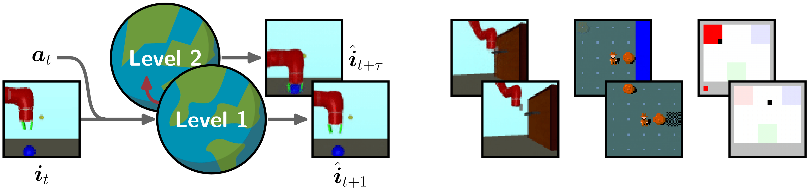

# THICK world models 

Implementation of THICK world models from our ICLR 2024 paper[ Learning Hierarchical World Models with Adaptive Temporal Abstractions from Discrete Latent Dynamics](https://openreview.net/pdf?id=TjCDNssXKU) in TensorFlow 2.

 

## Abstract

Hierarchical world models can significantly improve model-based reinforcement learning (MBRL) and planning by enabling reasoning across multiple time scales.
Nonetheless, the majority of state-of-the-art MBRL methods employ flat, non-hierarchical models. We propose Temporal Hierarchies from Invariant Context Kernels (THICK), an algorithm that learns a world model hierarchy via discrete latent dynamics. The lower level of THICK updates parts of its latent state sparsely in time, forming invariant contexts. The higher level exclusively predicts situa-
tions involving context changes. Our experiments demonstrate that THICK learns categorical, interpretable, temporal abstractions on the high level, while maintaining precise low-level predictions. Furthermore, we show that the emergent
hierarchical predictive model seamlessly enhances the abilities of MBRL or planning methods. We believe that THICK contributes to the further development of
hierarchical agents capable of more sophisticated planning and reasoning abilities.

# Installation

We provide a requirements file with our dependencies
```
pip3 install -r requirements.txt
```
**Note*:* For problems installing `nle` refer to the [installation guide](https://github.com/facebookresearch/nle#installation). Multiworld needs [mujoco](https://github.com/nimrod-gileadi/mujoco-py#install-mujoco) installed.


## Running experiments

### MiniHack

Running THICK Dreamer on MiniHack, e.g. the EscapeRoom problem:

`python3 train.py --logdir ~/logdir/minihack_escape/thick/0  --configs thick_minihack --task Minihack_escaperoomwater`

For KeyCorridor tasks the sparsity loss needs to be adjusted:

`python3 train.py --logdir ~/logdir/minihack_corridor8/thick/0 --configs thick_minihack --los_scales.ctxt_sparsity 1 --task Minihack_keycorridor8`

Running default DreamerV2 as a baseline:

`python3 train.py --logdir ~/logdir/minihack_corridor8/dreamerv2/0 --configs minihack --task Minihack_keycorridor8`


### PinPad

For the VisualPinpad experiments of our paper we first generated an exploration dataset with Plan2Explore:

`python3 train.py --logdir ~/logdir/pp4/plan2explore/0  --configs visualpinpad plan2explore --task pinpad_four`

Then we load the data to jumpstart training THICK Dreamer:

`python3 train_from_replay.py --logdir ~/logdir/pp4/thick/0 --load_dir ~/logdir/pp4/plan2explore/0  --configs thick_pinpad --task pinpad_four`

### Multiworld 

For zero-shot planning with THICK PlaNet we first generate a dataset withh Plan2Explore:

`python3 train.py --logdir ~/logdir/multiworld_door/plan2explore/0  --configs multiworld plan2explore --task MultiWorld_doorhook`

We use the offline dataset to train a THICK world model for hierarchical zero-shot planning:

`python3 train_only_on_replay.py --logdir ~/logdir/multiworld_door/thick/0 --load_dir ~/logdir/multiworld_door/plan2explore/0  --configs thick_multiworld --task MultiWorld_doorhook`

### New Environments

Try our default setting and run for example THICK Dreamer 

`python3 train.py --logdir ~/logdir/new_task/thick/0  --configs thick --thick_dreamer --task your_new_task --los_scales.ctxt_sparsity 1`

The hyperparameter `ctxt_sparsity` needs to be tuned to a value with sparse context changes.

## Acknowledgements

This code was developed based on the [DreamerV2](https://github.com/danijar/dreamerv2) code base. The CEM implementation is based on [PlaNet](https://github.com/google-research/planet). The MCTS implementation is based on [MuZero](https://www.nature.com/articles/s41586-020-03051-4). We provide a modified version of the [Multiworld](https://github.com/vitchyr/multiworld) environment in this code base. 

## Citation

```
@inproceedings{gumbsch2024thick,
title={Learning Hierarchical World Models with Adaptive Temporal Abstractions from Discrete Latent Dynamics},
author={Christian Gumbsch and Noor Sajid and Georg Martius and Martin V. Butz},
booktitle={The Twelfth International Conference on Learning Representations},
year={2024},
url={https://openreview.net/forum?id=TjCDNssXKU}
}
```
